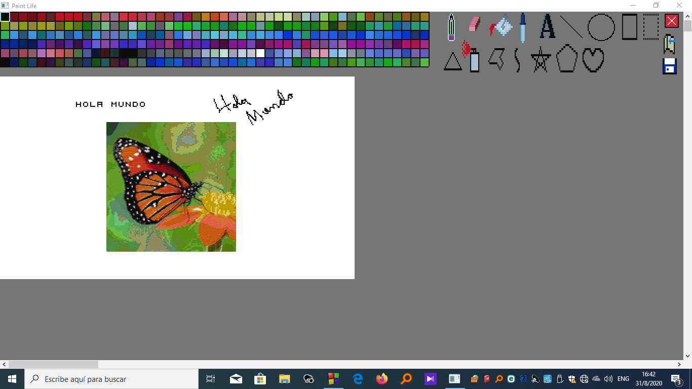
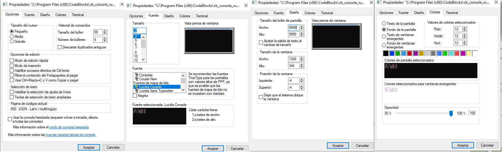

# **Paint Life** 🎨🖌️🧬

Author: **Ariel González Gómez** (arielgg46)

This application is inspired by Microsoft Paint and is intended to help programmers, masochistic cartoonists and people who are bored 🙂.

I started it around 5 years ago as a small experimentation project that grew little by little driven by my curiosity and enthusiasm. I'm glad to see how much it has been developed since then and to imagine how much it can be further developed. I know you have to be a little sick in the head to try to make a C++ CONSOLE DRAWING APPLICATION 🤪, where the "pixels" are literally colored letters, when there are so many visually oriented programming languages ​​and tools, but I was excited by the idea and everything I could do with C++ (also it was all I knew). I'm uploading it now because until recently my interaction with Github was scarse.

I confess that the project itself is very poorly done from a software engineering point of view, being very little object oriented, with few explanatory comments, bad naming convention, being all implemented in a single code file (considering the amount of lines of code is over **4000**🥵), etc. In my defense I was still learning to program, and I didn't know the best practices, or I was too lazy 😴. So my current goal with this project is to fix all these mistakes that I now recognize.

I hope this project contributes in some way to the community, and I'm open to all kinds of collaboration 🤝, criticism and suggestions that can improve the application 😀.

## ⛔ Limitations:
---

-   The "pixels" that this program uses to represent images are actually ASCII characters 176, 177 and 178 with a limited selection of text and background colors that are "blended" to create new, but still very limited colors, so the resolution and color of the images depends on the font and font size used. I recommend using the minimum size allowed by the console (in my case 1 x 2) and the Lucida Console font. Even this gives a somewhat reduced resolution.

    The font size can be changed by right clicking on the console window and opening the Properties window, in the Font tab (see attached config.png image). On most devices there should be the Lucida Console font and the smallest size we can set is 3 pixels wide by 5 pixels high. But then we can close the Properties window and with the console selected press Control while rolling the mouse wheel (as if we were zooming) to reduce it to 1 pixel wide by 2 pixels high. The program writes each of these characters twice (side by side) so that they are 2 pixels wide by 2 pixels high. 
    
    This form of representation provides pixels with a ratio of 2 wide by 2 high, but the main advantage is that the pattern of the characters used is not noticeable, which in other fonts or sizes ruins the uniformity and complete mix of the background colors and character text. Unfortunately, if your PC does not let you do the last step, the difference will be noticeable, and even more so in large figures such as the circumference, which because the pixels are taller than they are wide (3 wide by 5 high) creates an oval, not a circle.

-   When moving the scroll bar, the pixel where the program paints does not coincide with the one at the tip of the cursor. That is why it is not possible to make drawings whose resolution is greater than the size of the screen.

-   As these are characters that are printed to give the sensation of colored pixels, some things can be very slow (depending on the power of your PC). For example, starting the program prints the interface (the tool area, the color palette, and the drawing area), and this takes some time. The more “expensive” tools can be fill, rectangular selection, paste (with F or V), or simply make very large shapes.

---

## ⚙️ Before using:

Run the program, right click on the console window and open the Properties window. Put everything the same as in the attached `config.png` image:

In the colors area, for each color put the triplets of numbers from the `config.txt` document in the part of Selected Color Values ​​(where it says Red, below Green and lastly Blue) in that order.

Try to set the font size to 1 x 2 as explained above. If it works, open the config.txt document and change the first number that appears (it must be a 0 or a 1) for a 1, if it doesn't work (the minimum is 3 x 5 even when zooming) put a 0.

---

## 🛠️ The current version has the following tools or objects:

- A limited **palette of colors**, relatively ordered by the frequency spectrum of visible light (something like that). To change color, place the mouse cursor over the desired color and click.
- A rectangular **drawing area**, initially has a "transparent" color (the background is white, but when making a selection, which includes empty pixels, and pasting it in a place with color, these do not modify it). The current pixel is given by the cursor position. We can change the current drawing size of some tools (initially one pixel) through 'A' (increase) and 'D' (decrease).

- A **tool area** containing:
    - **Pen**: Draws a square of the setted size with the current pixel as the upper left corner. "Same as in Microsoft Paint".
    - **Eraser**: Replaces the pixels contained in a square of the set size, with the current pixel as the upper left corner (same as in the pencil) with "transparent" or "empty" pixels. “Same as in Microsoft Paint” (but with transparency).
    - **Fill**: fills all reachable pixels (share neighbors (adjacent in one of the 4 directions) in common) that have the same color as the pixel on which this tool is used, with the selected color (fills a "fenced" area with the selected color). We can use another version of this tool if once selected we click on it again. This will give it a red outline (to identify it). This other version changes the concept of adjacency from 4 directions to 8 directions, therefore the area you will paint must be completely closed. “Same as in Microsoft Paint” (the first version).
    - **Eyedropper/Eye-dropper**: selects in the palette the color of the pixel on which the tool is used (if it does not find the color in the palette, the color in the upper left corner of the palette will be selected). "Same as in Microsoft Paint".
    - **Text**: allows you to write a text that starts from the current pixel. For now, only one font type and size can be used because they are made "by hand" with our large pixels, which do not allow much variety. Also we can only type letters, numbers and few other ASCII characters. We end a text by clicking or pressing ESCAPE (esc). “Same as in Microsoft Paint” (but with a single font).
    - **Line**: allows drawing a straight line with one end at the pixel where we begin to create the line and the other end at the pixel where we end the line. "Same as in Microsoft Paint".
    - **Circumference**: allows you to create a circle (an oval if the PC only lets you use 3 x 5 pixels) centered on the pixel on which we use the tool (when clicking). We can change its size (with 'A' and 'D).
    - **Rectangle**: allows you to create a rectangle with one of its corners in the pixel where we started to create it and the opposite corner in the pixel where we finished. "Same as in Microsoft Paint".
    - **Rectangular Selection**: works the same as the previous tool but the rectangle you draw has jagged edges. While the selection is being made we can use 'C' (like Control + C) to copy the space contained in the figure, to the text document `copy.txt` in the application folder (later we can "paste" what we have in `copy.txt` using 'V'). We can also rotate the selection 90 degrees to the left (using 'A') or to the right (using 'D'). Also, you can drag the selection by clicking inside the selection and then dragging it to the other side. You can also change the size of the selection (enlarge or shrink) by dragging the borders. To end a selection you can press Escape (esc) or Backspace (which will also clear the selection). "Same as in Microsoft Paint".
    - **Isosceles triangle**: allows you to create an isosceles triangle with the base on the horizontal line to which the pixel in which we start the figure belongs (which is one of the vertices), the tip on the horizontal line to which the pixel belongs that we finish the figure and between the start and end pixels.
    - **Spray**: randomly colors the pixels contained within a square of the set size (which can be changed with 'A' and 'D') in a similar way to a normal spray. "Same as in Microsoft Paint".
    - **Polygon**: allows you to create a polygon by creating lines from the last vertex created to the next and ends when we close the figure. We create vertices by clicking. "Same as in Microsoft Paint".
    - **Bézier curve** (of any dimension): draws a line that we can curve as many times as we want (the app becomes slower the more points we add) by clicking on the points towards which it curves. In Bézier curves these points are called anchor points or knots. “Same as in Microsoft Paint” (but in that you can only curve twice).
    - **Pentagram** (pentagonal star, pentacle, pentalpha, pentangle or Pythagorean star): draws a pentagram from where we started to create it to where we finished. Actually, it's not a proper pentangle because it doesn't necessarily have 5 acute angles (it can be more stretched horizontally or vertically), but it's pretty close to the concept.
    - **Pentagon**: draws a pentagon from where we started to create it to where we finished. "Same as in Microsoft Paint".
    - **Heart**: draws a heart from where we started to create it to where we finished. "Same as in Microsoft Paint".
    - **Exit**: Shows an exit window to choose whether to cancel (close the window and continue) or save or not the drawing.
        - If we choose not to save the program closes and the changes made to the document are not saved.
        - If we chose to save and we had opened a document, the changes to it are saved and the program ends; Otherwise, another window opens to choose whether to cancel this action, or to add the name of the new document created (the “.txt” extension is automatically added).
    - **Open**: If there was a document open, a saving window opens like the one above. In any case, a window appears to open a document with the name that we enter in the text box (the “.txt” extension is automatically added).
    - **Save**: If there was no document open, a save window opens asking for the name of the new document. If something was open, the changes made to that document are simply saved.

To change the tool, place the cursor over the desired tool and click.

To "paste" the image representing the copy.txt document, press 'V' (like Control + V) and it will "paste" as a rectangle with the top right corner at the tip of the cursor.
To "paste" the `f.bmp image` (as a Paint Life image) press 'F' and it will "paste" as a rectangle with the top right corner at the tip of the cursor. The colors used in this Paint will be limited by what is described at the beginning of this document, therefore the images may not look as good as in a normal 24-bit `.bmp`. Also, there are `.bmp` images that are not compatible with this program and could present something like noise or random pixels in random places.
To change the size of the drawing area, we drag the upper or right border (or both). "Same as in Microsoft Paint".

The way the program encodes and decodes images is in the form of an array of integer pairs (representing a pixel) with the dimensions of the array (rows x columns) at the beginning of the document. The '-1 -1' represent "transparent" or "empty" pixels that when pasted into the editor do not affect the pixels that were there. Make sure the document has the name "copy.txt" and contains at least two positive integers as the dimensions or else errors may occur. Invalid values ​​(words, numbers less than -1, etc.) given as array values ​​may not be properly substituted.

To undo any drawing action press 'Z' (like Control + Z) and to redo it press 'Y' (like Control + Y).

---

## 🧬 **Life**
The "Life" in the name of this program is due to an implementation of the "Game of Life" by the british mathematician John Horton Conway.
It is a zero-player game, which means that its evolution is determined by the initial state and does not require any further input. The "game board" is a flat mesh made up of squares (the "cells") that extends to infinity in all directions (however in this Paint the mesh is the drawing area and it is limited). Therefore, each cell has 8 "neighbor" cells, which are the ones that are close to it, including the diagonal ones. Cells have two states: they are "alive" or "dead" (or "on" and "off"). The state of the cells evolves over discrete units of time (one could say "in turns"). The state of all the cells is taken into account to calculate the state of the cells the next turn. All cells are updated simultaneously each turn, following these rules:
• A dead cell with exactly 3 live neighboring cells is "born" (ie the next turn it will be alive).
• A living cell with 2 or 3 living neighboring cells remains alive, otherwise it dies (due to "loneliness" or "overpopulation").

In this program, the black pixels and the "transparent" or "empty" ones will be taken as dead cells and all the others as alive cells. By pressing ENTER we resume the game and the previous rules begin to be applied in turns. The speed of the turns can be increased (with UP arrow) or reduced (with DOWN arrow). The game can be paused at any time by pressing ESCAPE (esc).

---

## **Mod: TestCases** 🧠🧪
Ordered by: **Edian Broche**

This extension is intended to help create `.bmp` images that serve as input test cases for training and testing convolutional neural networks, specialized in pattern recognition, segmentation, and image classification.

**Use**: In the attached `config.txt` document, this will appear:
- **Resolución_mínima**: (as explained above determines if you can use 2x2 pixels (put a 1) or if you are limited to 3x5 (put a 0).
- **Microsoft_Paint**(1:yes,0:no): (establishes where the test cases are going to be drawn, we put a 1 to create the variations of a `.bmp ` already created in Microsoft Paint (program on which this application is based), we put a 0 to draw in our interface).
- **Nombre**: (sets the name that the created images will have. If the value above (Microsoft_Paint) is 1: the already created image from which the variations will come must have the name that we put in this field).
- **Pixeles_Horizontal**: sets the horizontal resolution (in pixels) of the images.
- **Pixeles_Vertical**: sets the vertical resolution (in pixels) of the images.
- **Variaciones_de_ruido_solo**: sets the number of variations with only “noise” added.
- **Variaciones_de_desplazamiento_solo**: sets the number of variations with only “scroll” added.
- **Variaciones_de_ruido_y_desplazamiento**: sets the number of variations with both “noise” and “displacement” added.
- **Variaciones_de_reflexion**(1:yes,0:no): if we put 1 all the variations created previously will have a copy flipped horizontally, if we put 0 they won't (duh).
- **Rango_de_variación_de_ruido**: sets the range in which the random values ​​added or subtracted to the RGB components (individually) of each pixel of the original image variation oscillate.
- **Rango_de_variación_de_desplazamiento**: sets the range in which the random values ​​oscillate by which the image is scrolled up, down, left or right (individually).

Once these values ​​are filled in, we can run Paint Life and start drawing. Every time we finish a drawing we click on the **Save** button, and several files of the following format will be created: name_x_y.bmp, where "name" is replaced by the value of the Name field previously filled out, "x" specifies the number of the batch that contains each natural image and its variations, it starts with 0, and each time we press the **Save** button it increases by 1, “y” specifies the number of each variation of the original image (which starts the batch with 0).

If the value of the previously filled Microsoft_Paint field was 1, when running Paint Life, the drawing interface will not appear, but the variations will be created directly.